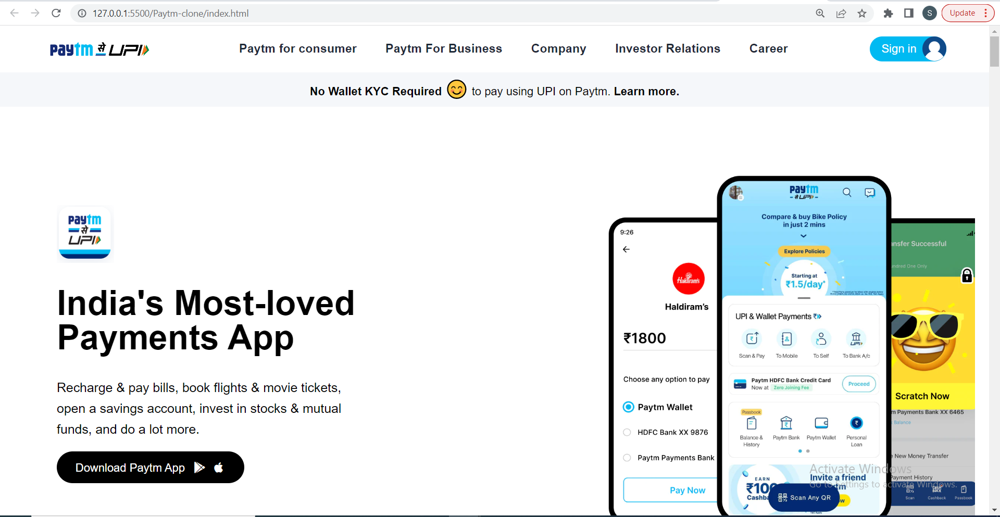
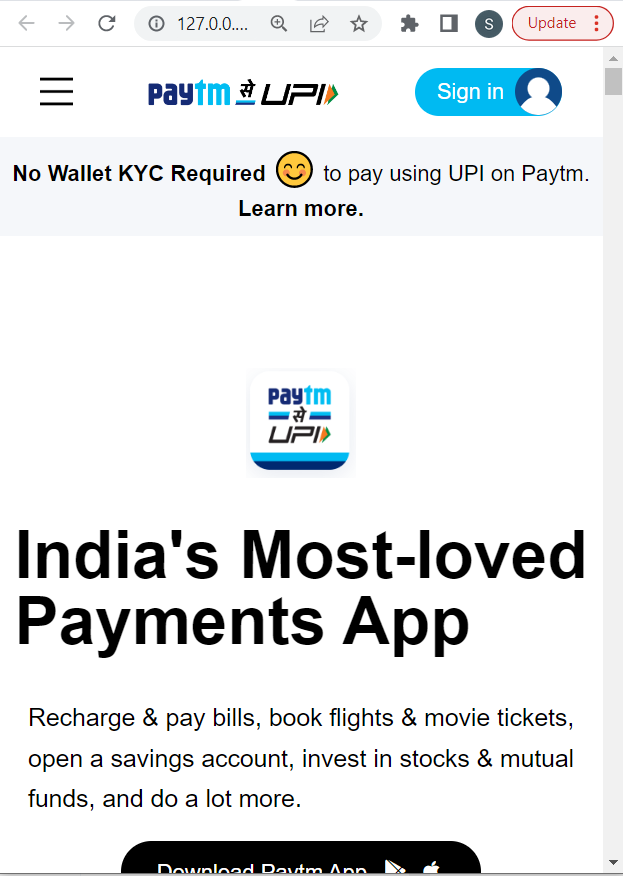

# Paytm-clone

This is basically a clone of [Paytm](https://paytm.com/) Desktop Version Website made purely in HTML5 and tailwind css a utility first css Framework. This has also been made mobile responsive for better view using Tailwind CSS
Hope you like my project !!

## Technologies Used
  - HTML
  - Tailwind css - A Utility First Framework of CSS

## Demo
### Laptop View


### Mobile Screen View


## Run Locally

Clone the project

```bash
  git clone https://github.com/suhas-sm/Paytm-clone.git
```

Go to the project directory

```bash
  cd Paytm-clone
```
## Features

- Royalty Free Images used
- Logo Hover Effect
- Beautifull UI/UX Design
- Clone Website
- Hosted on Netlify and set up in production
- Tried to replicate Paytm website
- Made it mobile responsive

## What i have learnt By working on this project
1. Had a good understanding on how to make responsive websites in tailwind

## Honest Time to finish the project

I had took about 8-10 hrs

## Feedback
If you have any feedback, please reach out to us at melmurissm11@gmail.com
